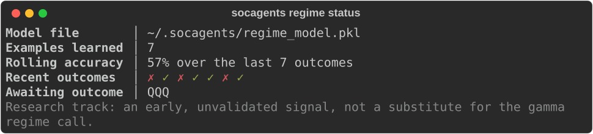

# SOCAgents

**An open-source, multi-agent trading desk for options and futures.**

A team of AI agents reads dealer positioning, options flow, and price action, argues the bull and bear case, and hands you an evidence-cited desk report. It runs free on public data. It gets real-time institutional flow and dealer positioning from [SocSwift](https://socswift.com/?ref=socagents&utm_source=github&utm_medium=readme) when you are a member.

> **Status: pre-alpha.** SOC Desk, the Community data provider, member data, the CLI, and the MCP server are implemented. The package is not on PyPI yet, so install it from source. Star or watch the repository to follow progress.

<!-- Demo: docs/assets/desk-demo.gif, a 45-second recording of `socagents desk SPX` with analysts working and debating live. -->

## Why SOCAgents

- Index options move around dealer hedging and 0DTE flow. Generic AI agents read neither.
- SOC Desk is built for SPX, SPY, QQQ, and US equities with listed options. Dealer hedge flow for ES and NQ comes later for members.
- **The LLM proposes. Deterministic code disposes.** Nothing trades without your approval, and a code-based risk engine checks every idea.
- Every number in a report cites the data snapshot it came from.

## Quickstart

```bash
git clone https://github.com/dearvn/SOCAgents.git && cd SOCAgents
python -m venv .venv && source .venv/bin/activate && pip install -e ".[mcp]"

# offline: bundled synthetic data and a scripted model, no account or key
socagents desk SPY --provider fixture

# free delayed public data with your own model
export ANTHROPIC_API_KEY=...        # or OPENAI_API_KEY / GOOGLE_API_KEY
socagents desk SPX -m anthropic/<model>                  # standard profile, live terminal view
socagents desk QQQ -m anthropic/<model> --profile lite   # fewer agents, faster, cheaper
socagents ask "Where is SPX dealer gamma flipping today?" -m anthropic/<model>
socagents brief --symbols SPY,QQQ -m anthropic/<model>

socagents config set default_model anthropic/<model>     # skip -m from now on
socagents doctor                                         # check keys, storage, and data sources
```

Run fully local with Ollama:

```bash
socagents desk SPY -m ollama/<model> --profile lite   # one model for every role
```

## How It Works

```text
               ┌─ Dealer Positioning ─┐
               ├─ Flow                ┤
socagents ────>├─ Futures Hedge *     ├──> Bull ⇄ Bear ──> Strategist ──> Risk Officer ──> Desk Lead ──> Desk Report
desk SPX       ├─ Technical           ┤                                  (code first,
               └─ Event and News ─────┘                                   LLM second)
```

\* Futures Hedge runs in the `deep` profile for members, after v0.1.

- Analysts run in parallel, each with its own tools and model.
- Bull and bear researchers argue from the analysts' evidence.
- The Strategist proposes ideas. The Risk Officer runs deterministic limits first. The Desk Lead writes the report.
- In Community mode the data is delayed, so ideas are educational and never risk-checked for execution.
- Details: [SOC Desk design](docs/soc-desk.md).

## Community vs Member

| | Community (free) | Member (SocSwift) | Availability |
|---|---|---|---|
| Data | delayed public quotes and option chains | real-time SocSwift data | v0.1 |
| Dealer positioning | open-interest GEX estimate | SocSwift GEX engine, regime, expected range | v0.1 |
| Options flow | volume vs open interest changes | live 0–1 DTE and 2+ DTE institutional flow with filters | v0.1 |
| Trade ideas | educational only (delayed data) | risk-checked on live data | v0.1 |
| Futures hedging | not available | dealer hedge flow for ES/NQ | planned, after v0.1 |
| Desk inside SocSwift, schedules, alerts | no | yes | planned |
| Trade plans to your broker (with approval) | no | yes, on eligible plans | planned, SIM first |
| Model cost | your own key or local model | your own key in CLI/MCP; included in-app within plan quota | — |

SocSwift data is available only to SocSwift members. [See plans and trial](https://socswift.com/?ref=socagents&utm_source=github&utm_medium=readme).

## Example Desk Report (Community mode, illustrative numbers)

```text
SOC Desk · SPX · Community mode · data delayed · 2026-09-10 13:45 ET

Regime       positive gamma (estimate), mean-reverting
Key levels   5850 call OI wall · 5790 est. zero-gamma · 5750 put OI wall
Base case    holds above 5790 → range 5800–5850
Bear case    3m close below 5790 → expansion toward 5750
Dissent      bear researcher: put volume rising into the close
Sources      option chain 13:45 ET (delayed) · 5m bars 13:45 ET

Member data would add live 0DTE institutional flow, SocSwift's GEX regime, and dealer hedge flow.
Not investment advice.
```

Trade ideas appear only in your own terminal. In Community mode they are labeled educational because the data is delayed. Shared and public reports never include trade ideas.

## Use It From Claude Desktop or Any MCP Client

```json
{
  "mcpServers": {
    "socagents": {
      "command": "socagents",
      "args": ["mcp", "serve"],
      "env": { "ANTHROPIC_API_KEY": "...", "SOCAGENTS_MODEL": "anthropic/<model>" }
    }
  }
}
```

Then ask your assistant: "Run the SOC Desk on SPX." The multi-agent `run_desk` tool makes its own model calls, so the MCP server needs a provider key and a model (or a local model). Without a key, the data tools and the `desk` prompt still work on your assistant's own model. Members add their SocSwift API key with `socagents login`.

## v0.1 Features

- SOC Desk with `lite` and `standard` profiles, and `deep` for members
- Live terminal view of the desk
- Community data provider: delayed quotes, option chains, bars, headlines, GEX estimate, flow estimate, technicals
- SocSwift data for members through the SocSwift Agent API
- CLI (`desk`, `ask`, `brief`, `replay`, `report`, `skills`, `login`, `config`, `doctor`) and a local MCP server
- Replay a desk on its recorded data to compare models, prompts, or skills
- Skills: strategy playbooks (`SKILL.md`) that guide desk roles, with three official ones
- Your own MCP servers (for example a broker's positions) as read-only desk tools, with allowlists, order-verb blocking, and change detection
- Any model: Anthropic, OpenAI, Google, or local models through Ollama, set per role
- Deterministic risk engine, and key levels checked against the data they cite
- Markdown and JSON export of Community reports (without trade ideas)

## Roadmap

| Phase | Scope |
|---|---|
| P0 | Foundation: runtime, model gateway, tool SDK, data providers |
| P1a | Public launch: SOC Desk, Community mode, member data, CLI, MCP |
| P1b | Ecosystem: hosted MCP, external MCP tools, skills, TradingAgents plugin, replay |
| P2 | Desk inside SocSwift, schedules, alerts, memory |
| P3 | Trade plans to SocSwift pre-orders on SIM, with approval |
| P4–P5 | Supervised SIM automation; live trading with approval after legal review |

## Research Track: Continual Learning

Markets are non-stationary — a model trained once decays as regimes shift. `get_regime_estimate` is a small online classifier (predict-now / learn-later) that guesses whether a symbol is trending or mean-reverting, then scores its own past guess once the outcome is knowable and learns from it — no retraining pipeline, no shared model between users. The Dealer Positioning and Technical analysts cite it as evidence like any other tool.

Track how it's doing with `socagents regime status`:



This is scoped to a single instance, not shared across users. Unlike positive-sum domains such as fraud detection, pooling trading signals across users degrades their value as the market arbitrages them away. Early-stage research: the label heuristic behind it is an unvalidated placeholder, not a proven trading edge — treat it the same way as the GEX/flow "estimate" labels, not part of a shipped profile or roadmap phase yet.

## Documentation

Design docs and the CLI reference: [docs/](docs/README.md).

## Contributing

New data providers, analyst roles, and strategy skills are the most wanted contributions. See [CONTRIBUTING.md](CONTRIBUTING.md).

## Security

Please report vulnerabilities privately. See [SECURITY.md](SECURITY.md).

## Disclaimer

SOCAgents is software for research and education. It is not investment advice, and nothing it produces is a recommendation to buy or sell any security. AI agents can be wrong, use stale data, and behave unexpectedly. Options and futures involve substantial risk of loss. You are responsible for your own trading decisions.

## License

[Apache License 2.0](LICENSE).
